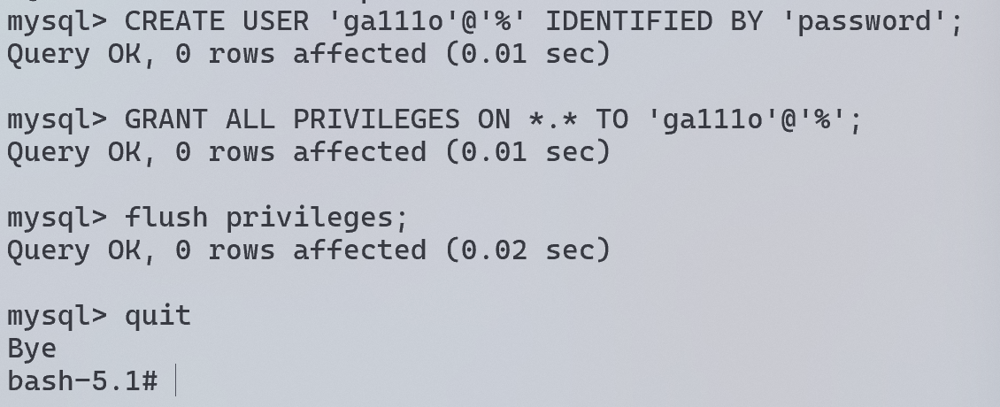

1. docker mysql image 다운로드

   - `docker pull ga111o/chic-dbstudy-food-recommendation:latest`
   - `docker images`했을 때 정상적으로 떠야함
     

2. docker mysql container 생성 & 실행

   - `docker run mysql:latest`

   하지만, docker에 db를 설치할 경우, 컨테이너 삭제와 함께 데이터도 날라가기에 외부 저장소를 추천함.

   - `docker run -d -p 3336:3306 -e MYSQL_ROOT_PASSWORD=password --name chic-dbstudy-food-recommendation -v {마운트할저장소경로}:/var/lib/mysql ga111o/chic-dbstudy-food-recommendation:latest --character-set-server=utf8mb4 --collation-server=utf8mb4_unicode_ci`

   - `docker run -d -p 3336:3306 -e MYSQL_ROOT_PASSWORD=password --name chic-dbstudy-food-recommendation -v /home/ga111o/document/MarkDown/kwu-chi-community/CHIC_24_Database-Study/강민혁/mysql:/var/lib/mysql ga111o/chic-dbstudy-food-recommendation:latest --character-set-server=utf8mb4 --collation-server=utf8mb4_unicode_ci`

   

3. docker 컨테이너 bash 쉘 접속

   - docker exec를 통해 docker 컨테이너에 접근 후 mysql에 로그인

   - `docker exec -it chic-dbstudy-food-recommendation bash`

4. mysql 서버 접속

   - `# mysql -u root -p`

5. db 및 사용자 생성 & 컨테이너 내의 mysql에서 권한 부여

   > 컨테이너 외부에서도 mysql에 로그인 가능해야 하기에 {유저}@localhost 대신 {유저}@% 사용

   - `> CREATE USER 'ga111o'@'%' IDENTIFIED BY 'password';`
   - `> GRANT ALL PRIVILEGES ON *.* TO 'ga111o'@'%';`
   - `> flush privileges;`

   

6. 테스트
